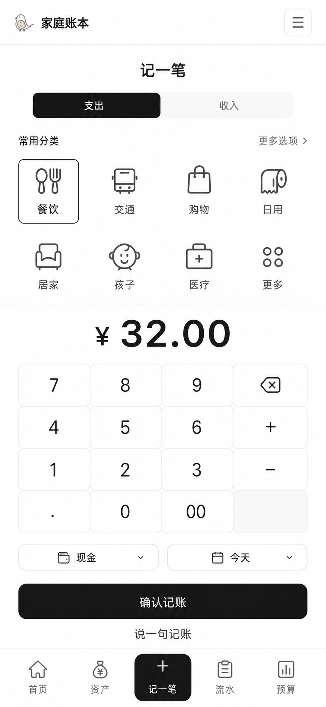

# 分类优先的 3 秒记账设计

**日期：** 2026-07-12

**状态：** 等待用户审阅

**设计目标：** 将手机端“记一笔”从完整财务表单改为分类优先的单屏快速记账，让常见支出在 3 秒左右完成；桌面端和现有账务数据边界保持不变。

**视觉目标：**



视觉图用于确认布局和交互层级；图中的分类名称是早期示意，产品实际读取当前账本已有分类。

## 1. 用户目标

用户在付款后打开手机应用，希望快速记录“花了多少钱、花在哪里”，而不是填写币种、预算、来源账户、目标账户、日期和备注等完整字段。

主流程压缩为：

```text
底部“记一笔”
  → 选择/确认常用分类
  → 输入金额
  → 确认记账
```

日期、币种、账户和预算采用智能默认；低频字段通过“更多选项”渐进展开。

## 2. 范围

### 包含

- 手机端 `/management/ledger?focus=create` 的分类优先快速记账界面。
- 支出/收入切换、常用分类、金额键盘、账户与日期快捷项。
- 对齐快速记账所需的起始分类数据，并为已有账本只补齐缺失分类。
- “更多选项”中的完整字段编辑。
- “说一句记账”作为与手工快速记账并列的备用入口。
- 复用现有 `createTransaction`、分类、账户、预算和 SWR 刷新逻辑。
- 创建成功后的预算反馈与流水可见性。
- `360×640`、`360×800`、`390×844`、`412×839` 和 `360×520` 回归。

### 不包含

- 桌面流水页面重绘。
- Prisma schema、API、认证协议或 Server Action 改造。
- 自动读取微信/支付宝账单、OCR 或系统级无障碍自动记账。
- Android 原生页面、Capacitor 插件或 Google Play 发布步骤。
- 全站分类图标系统重做。

## 3. 信息层级

手机首屏只保留六个层级：

1. 顶栏：家庭账本品牌和“更多”菜单。
2. 页面标题：`记一笔`。
3. 类型切换：`支出 / 收入`，默认支出。
4. 常用分类：最多 8 个，4 × 2 排列。
5. 金额区：大号金额、数字键盘、账户与日期快捷项。
6. 主操作：`确认记账`；下方提供次要入口 `说一句记账`。

底部继续使用现有五项导航，中间“记一笔”保持选中。

## 4. 常用分类

- 只显示当前交易类型可用的分类。
- 首版不做最近 90 天使用频率排序，直接从当前账本已有分类中读取，不维护第二套快速记账分类。
- 支出分类以 `餐饮、房租、交通、医疗、固定支出、日用、提升品质、旅行、人情往来` 为起点；首屏显示前 7 项，第 8 项固定为“更多”，`旅行、人情往来` 从“更多”进入。
- 收入分类以 `工资、理财收益、人情往来` 为起点；分类不足 7 项时按实际数量展示，并在末尾保留“更多”。
- `人情往来` 可以同时存在于支出和收入中，按交易类型分别保存和筛选，互不混用。
- 已有账本缺少 `日用（支出）` 或 `人情往来（收入）` 时，只补齐缺失的“名称 + 类型”组合；重复执行不得产生重复分类，也不得覆盖、重命名或删除用户已有分类。
- 用户后续新增、删除或重命名分类后，快速入口同步使用现有分类数据；未列入上述起始顺序的分类追加在“更多”面板中。
- 按使用频率自动排序属于后续个性化能力，不纳入本阶段。
- 本地记住最近一次成功使用的分类；下次进入同一交易类型时默认选中。
- 点击“更多”打开底部面板，展示该类型全部分类。
- 分类必须同时显示统一风格的线性图标和文字，不使用 emoji。
- 首版使用 `lucide-react` 图标并按分类名称映射；未知分类使用统一的通用分类图标，不修改数据库模型。

## 5. 金额键盘

- 金额始终显示在首屏，字号和视觉权重高于其他字段。
- 自定义键盘提供 `0–9`、`00`、小数点、退格、`+` 和 `−`。
- `+ / −` 用于简单的连续加减，例如 `28 + 6`，显示区同时展示表达式和计算结果。
- 金额最多保留两位小数；空值、零或非法表达式不能提交。
- 收入/支出由顶部类型决定，金额本身始终保存为正数。

## 6. 智能默认与更多选项

首屏快捷项：

- 账户：默认最近一次成功记账使用的来源账户；无记录时显示“不指定”。
- 日期：默认今天。

分类和日期确定后，继续复用现有预算匹配逻辑；若只有一个匹配预算则自动关联。

点击账户或日期快捷项可直接修改。点击“更多选项”打开底部面板，包含：

- 币种
- 预算
- 来源账户
- 目标账户
- 日期
- 备注
- 保存为模板
- 转账类型

选择“转账”后，分类区隐藏，来源账户和目标账户成为必填；金额键盘保持不变。

## 7. 自然语言入口

“说一句记账”不是生成草稿后再进入完整九字段表单，而是切换同一快速记账界面的输入模式：

1. 用户输入或说“今天午饭 32 用现金”。
2. 现有本地解析器识别类型、金额、分类、账户和日期。
3. 解析结果直接填入分类优先界面。
4. 用户在同一界面检查后点击“确认记账”。

解析失败时保留原输入并显示具体错误，不修改已有快速记账状态。

## 8. 创建与反馈

- `确认记账` 继续调用现有 `createTransaction`，不新增写入路径。
- 提交期间按钮禁用，避免重复流水。
- 服务端成功后才清空金额和自然语言输入。
- 成功反馈优先显示与当前决策相关的信息，例如：

```text
已记 ¥32 · 餐饮预算还剩 ¥568
```

- 无关联预算时只显示 `已记 ¥32 · 餐饮`。
- 新流水通过现有 SWR 刷新出现在列表中。
- 创建失败时保留分类、金额和更多选项，允许修改后重试。
- 会话失效继续跳转 `/login`。

## 9. 手机与桌面边界

- `< 768px` 且 `focus=create`：显示新的分类优先快速记账界面，隐藏当前完整创建表单。
- `< 768px` 的普通流水页：继续显示流水列表，不自动展开快速记账。
- `>= 768px`：桌面创建表单保持当前结构和行为。
- 快速记账区域可垂直滚动；在 `360×520` 键盘压力视口中，确认按钮仍必须能够滚动到达。
- 所有交互控件至少 `44 × 44px`。

## 10. 组件边界

建议新增：

- `MobileQuickEntry`：手机快速记账主容器和提交状态。
- `FrequentCategoryGrid`：现有分类筛选、起始顺序、选中和“更多”。
- `AmountKeypad`：金额表达式与加减计算。
- `QuickEntryMoreSheet`：低频字段底部面板。

继续复用：

- `LedgerAgentQuickEntry` / `buildLedgerAgentDraft`
- `buildLedgerCreateFormValues`
- `createTransaction`
- `LedgerManager` 中的分类、账户、预算和 SWR 数据
- 现有 `MobileNavigation`

纯逻辑应从 UI 中分离：现有分类筛选与显示上限、金额表达式计算、默认值恢复和成功反馈文案分别提供可测试函数。

## 11. 验收标准

### 核心流程

1. 点击底部“记一笔”进入分类优先界面。
2. 支出为默认类型，首屏依次显示 `餐饮、房租、交通、医疗、固定支出、日用、提升品质` 和“更多”，且无换行裁切。
3. 用户可以选择分类、输入金额并在不展开更多选项的情况下完成记账。
4. 切换到收入后显示 `工资、理财收益、人情往来` 和“更多”，收入与支出的同名“人情往来”使用各自的分类记录。
5. 已有账本只补齐缺失的 `日用（支出）` 和 `人情往来（收入）`，重复执行不产生重复项。
6. 最近分类、最近账户和今天日期正确默认。
7. `+ / −` 金额计算结果正确，非法金额不能提交。
8. “说一句记账”解析后留在同一快速界面，不跳回完整表单。
9. 成功后显示明确反馈，新流水出现。
10. 失败后数据保留，允许重试。

### 响应式与可访问性

1. `360×640`、`360×800`、`390×844`、`412×839` 无页面级横向滚动。
2. `360×520` 中金额、分类和确认按钮可以滚动到达。
3. 分类、键盘和按钮触控区域均不小于 `44 × 44px`。
4. 类型、分类、账户、日期和提交状态均有可读标签与键盘焦点。
5. 桌面创建表单和现有流水维护功能不回归。

## 12. 测试策略

- 单元测试：现有分类筛选、起始顺序、显示上限、同名异类筛选、缺失分类幂等补齐、金额表达式、默认值和反馈文案。
- 组件测试：8 项分类上限、类型切换、更多面板、自然语言回填和按钮禁用。
- Playwright：在 `390×844` 完成一次分类优先真实记账，并在 `360×520` 验证滚动可达。
- 回归：现有自然语言解析、SWR 刷新、持久化清理、桌面 `1440×900` 和 Google Play 截图。

## 13. 明确取舍

- 图标用于降低分类识别成本，但首屏不展示完整分类墙。
- 不为了“更像 App”复制竞品黄色主题或游戏化猫咪；继续使用家庭账本现有黑白视觉语言。
- 第一阶段优先减少一次记账的必填决策，不扩展新的分析、协作或导入能力。
